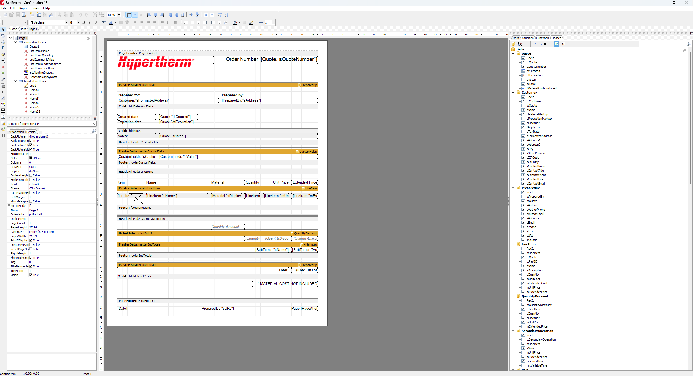

# Files for Hypertherm

A collection of files for Hypertherm. Quote forms are in XML format and are used for the printing of quotes.

## Hypertherm Quote Forms

- `order-confirm.xml`: Quote form for printing.
- `order-quote.xml`: Quote form for ordering.

## Aux information

- FastReport 4.6 [User Manual](https://www.fast-report.com/documentation/UserManStudio/index.html) for XML documents
- W3Schools [XML Tutorial](https://www.w3schools.com/xml/default.asp) and documentation
- Clever Techie: [XML Tutorial](https://www.youtube.com/watch?v=KeLiQXqVgMI) on YouTube
- dcode: Parsing XML with javascript [Youtube video](https://www.youtube.com/watch?v=lUCQgqc4K2A)

## FastReport

- Uses Pascal for logic
- Right side of UI has available parameters

 
 
 
 

---

Copyright© 2024 SafetyDav3
